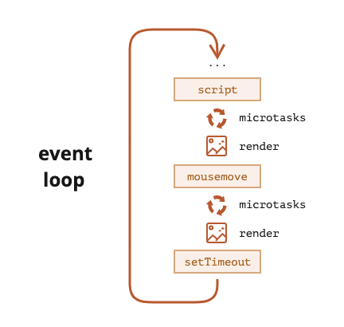

####  **event loop**工作原理

1. 先执行`callstack`里面的方法，方法栈中方法调用完成后；

2. 再调用微任务(microtask)里面的方法；

3. 再调用宏任务(macrotask)里面的方法。




代码练习:

```javascript
console.log(1);

setTimeout(() => console.log(2));

Promise.resolve().then(() => console.log(3));

Promise.resolve().then(() => setTimeout(() => console.log(4)));

Promise.resolve().then(() => console.log(5));

setTimeout(() => console.log(6));

console.log(7);
```

输出结果:

```javascript
输出结果为：1 7 3 5 2 6 4
```

解释过程:

```js
console.log(1);
// 第一行立即执行，它输出 `1`。
// 到目前为止，宏任务队列和微任务队列都是空的。

setTimeout(() => console.log(2));
// `setTimeout` 将回调添加到宏任务队列。
// - 宏任务队列中的内容：
//   `console.log(2)`

Promise.resolve().then(() => console.log(3));
// 将回调添加到微任务队列。
// - 微任务队列中的内容：
//   `console.log(3)`

Promise.resolve().then(() => setTimeout(() => console.log(4)));
// 带有 `setTimeout(...4)` 的回调被附加到微任务队列。
// - 微任务队列中的内容：
//   `console.log(3); setTimeout(...4)`

Promise.resolve().then(() => console.log(5));
// 回调被添加到微任务队列
// - 微任务队列中的内容：
//   `console.log(3); setTimeout(...4); console.log(5)`

setTimeout(() => console.log(6));
// `setTimeout` 将回调添加到宏任务队列
// - 宏任务队列中的内容：
//   `console.log(2); console.log(6)`

console.log(7);
// 立即输出 7
```

总结一下：

1. 立即输出数字 `1` 和 `7`，因为简单的 `console.log` 调用没有使用任何队列。
2. 然后，主代码流程执行完成后，开始执行微任务队列。
   - 其中有命令行：`console.log(3); setTimeout(...4); console.log(5)`。
   - 输出数字 `3` 和 `5`，`setTimeout(() => console.log(4))` 将 `console.log(4)` 调用添加到了宏任务队列的尾部。
   - 现在宏任务队列中有：`console.log(2); console.log(6); console.log(4)`。
3. 当微任务队列为空后，开始执行宏任务队列。并输出 `2`、`6` 和 `4`。

最终，我们的到的输出结果为：`1 7 3 5 2 6 4`。


#### Promise实现原理


#### 参考链接

> evenloop部分

[Event loop: microtasks and macrotasks](https://javascript.info/event-loop)

[Using microtasks in JavaScript with queueMicrotask()](https://developer.mozilla.org/en-US/docs/Web/API/HTML_DOM_API/Microtask_guide)

[The event loop](https://developer.mozilla.org/en-US/docs/Web/JavaScript/Event_loop#stack)

[In depth: Microtasks and the JavaScript runtime environment](https://developer.mozilla.org/en-US/docs/Web/API/HTML_DOM_API/Microtask_guide/In_depth)

[Tasks, microtasks, queues and schedules](https://jakearchibald.com/2015/tasks-microtasks-queues-and-schedules/)

> promise部分

[PromiseA+规范/原理 及 实现方式](PromiseA+规范/原理 及 实现方式)

[promise Implementing](https://www.promisejs.org/implementing/)

> 前端手写面试题

[手写面试题](https://juejin.cn/post/7083674750500732936)

[一文带你梳理React面试题](https://juejin.cn/post/7182382408807743548)